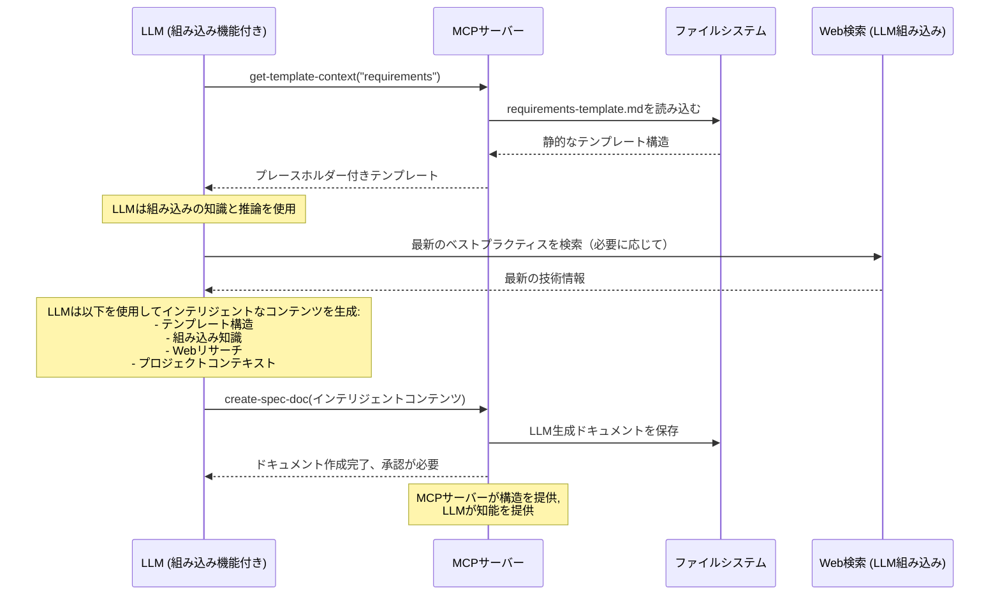

# MCPツール APIリファレンス

> **クイックナビゲーション**: [ワークフローツール](#workflow-tools) | [コンテンツツール](#content-tools) | [検索ツール](#search-tools) | [ステータスツール](#status-tools) | [承認ツール](#approval-tools)

## 📋 ツールカテゴリ

| カテゴリ | ツール | 目的 |
|----------|-------|---------|
| **ワークフロー** | `spec-workflow-guide`, `steering-guide` | ワークフローの手順を提供 |
| **コンテンツ** | `create-spec-doc`, `create-steering-doc`, `get-template-context` | ドキュメントの作成とテンプレート化 |
| **検索** | `get-spec-context`, `get-steering-context`, `spec-list` | 既存のコンテンツの検索と読み込み |
| **ステータス** | `spec-status`, `manage-tasks`, `refresh-tasks` | 進捗の追跡 |
| **承認** | `request-approval`, `get-approval-status`, `delete-approval` | 承認ワークフローの管理 |

## 🔄 ワークフローツール

### `spec-workflow-guide`

**目的**: スペック駆動開発のための完全なワークフロー手順を読み込む

**使用法**: ユーザーがスペック作成や機能開発をリクエストした際に**最初**に呼び出す

```typescript
// パラメータ: なし
{}

// レスポンス
{
  success: true,
  message: "完全なスペックワークフローガイドが読み込まれました - このワークフローに正確に従ってください",
  data: {
    guide: "# スペック開発ワークフロー...",
    dashboardUrl?: string,
    dashboardAvailable: boolean
  },
  nextSteps: [
    "シーケンスに従う: 要件 → 設計 → タスク → 実装",
    "最初にget-template-contextでテンプレートを読み込む",
    "各ドキュメントの後に承認をリクエストする"
  ]
}
```

**ワークフローシーケンス**:
1. 要件フェーズ → 2. 設計フェーズ → 3. タスクフェーズ → 4. 実装フェーズ

**主要ルール**:
- ✅ 常にMCPツールを使用し、手動でのドキュメント作成は行わない
- ✅ 各フェーズ間で明示的な承認を得る
- ✅ フェーズを順番に完了させる（スキップしない）
- ❌ 口頭での承認は絶対に受け付けない - ダッシュボード/VSCodeのみ

**計画プロセスアーキテクチャ**:
- ✅ **テンプレートベースの構造**: `/src/markdown/templates/` から静的テンプレートを使用
- ✅ **LLMによるコンテンツ生成**: 接続されたLLMが組み込み機能を使用してテンプレートを埋める
- ✅ **LLMの組み込み知識**: LLMがトレーニングを通じてソフトウェアエンジニアリングのベストプラクティスを適用
- ✅ **LLMのWebリサーチ**: LLMが現在の技術やプラクティスについてWeb検索を実行可能
- ✅ **ワークフロー検証**: サーバーが適切なシーケンスと構造を強制
- ✅ **人間によるレビュー必須**: すべてのLLM生成コンテンツにはダッシュボード/VSCodeでの承認が必要

**コンテンツ生成フロー**:


---

### `steering-guide`

**目的**: プロジェクトステアリングドキュメント作成のための手順を読み込む

**使用法**: プロジェクトのガイドラインやアーキテクチャコンテキストを確立する際に呼び出す

```typescript
// パラメータ: なし
{}

// レスポンス
{
  success: true,
  message: "ステアリングガイドが正常に読み込まれました",
  data: {
    guide: "# ステアリングドキュメントガイド...",
    dashboardUrl?: string
  }
}
```

**ステアリングドキュメントの種類**:
- **product.md**: 製品ビジョンと要件
- **tech.md**: 技術標準とアーキテクチャ決定
- **structure.md**: コード構成とファイル構造

## 📝 コンテンツツール

### `create-spec-doc`

**目的**: ワークフローシーケンスに従って仕様書ドキュメントを作成または更新する

**使用法**: 各フェーズのコンテンツを生成した後、テンプレートを読み込んだ**後**に呼び出す

```typescript
// パラメータ
{
  projectPath: "/absolute/path/to/project",
  specName: "user-authentication",     // kebab-caseのみ
  document: "requirements",            // "requirements" | "design" | "tasks"
  content: "# Requirements Document\n..." // 完全なマークダウンコンテンツ
}

// レスポンス
{
  success: true,
  message: "requirements.mdを.spec-workflow/specs/user-authentication/requirements.mdに作成しました\n\nブロッキング: ダッシュボードまたはVSCode拡張機能で承認をリクエストする必要があります。",
  data: {
    specName: "user-authentication",
    document: "requirements",
    filePath: ".spec-workflow/specs/user-authentication/requirements.md"
  }
}
```

**ワークフロー強制**:
- ❌ `requirements.md`なしで`design.md`は作成不可
- ❌ `design.md`なしで`tasks.md`は作成不可
- ✅ `.spec-workflow/specs/`ディレクトリ構造を自動作成

**次のステップ**: 作成後すぐに`request-approval`を呼び出す

---

### `create-steering-doc`

**目的**: アーキテクチャガイダンスのためのプロジェクトステアリングドキュメントを作成する

```typescript
// パラメータ
{
  projectPath: "/absolute/path/to/project",
  document: "product",                 // "product" | "tech" | "structure"
  content: "# Product Vision\n..."     // 完全なマークダウンコンテンツ
}

// レスポンス
{
  success: true,
  message: "product.mdを.spec-workflow/steering/product.mdに作成しました",
  data: {
    document: "product",
    filePath: ".spec-workflow/steering/product.md"
  }
}
```

---

### `get-template-context`

**目的**: 適切なフォーマットの特定のドキュメントテンプレートを読み込む

**使用法**: 現在のフェーズに必要な正確なテンプレートで呼び出す

```typescript
// パラメータ
{
  projectPath: "/absolute/path/to/project",
  templateType: "spec",                // "spec" | "steering"
  template: "requirements"             // 以下のテンプレートオプションを参照
}

// レスポンス
{
  success: true,
  message: "スペック用の要件テンプレートを読み込みました",
  data: {
    context: "## 要件テンプレート\n\n[テンプレートコンテンツ...]",
    templateType: "spec",
    template: "requirements",
    loaded: "requirements-template.md"
  },
  nextSteps: [
    "要件ドキュメントにテンプレートを使用",
    "テンプレート構造に正確に従う",
    "次: document: \"requirements\"でcreate-spec-doc"
  ]
}
```

**テンプレートオプション**:

| templateType | 利用可能なテンプレート |
|--------------|-------------------|
| `spec` | `requirements`, `design`, `tasks` |
| `steering` | `product`, `tech`, `structure` |

## 🔍 検索ツール

### `get-spec-context`

**目的**: 再開作業のために既存の仕様書ドキュメントを読み込む

**使用法**: 休憩後や新規に作成していないスペックで作業を再開する場合に**のみ**呼び出す

```typescript
// パラメータ
{
  projectPath: "/absolute/path/to/project",
  specName: "user-authentication"
}

// レスポンス - 成功
{
  success: true,
  message: "仕様書コンテキストが正常に読み込まれました: user-authentication",
  data: {
    context: "## 仕様書コンテキスト (プリロード済み): user-authentication\n\n### 要件\n[コンテンツ]\n\n### 設計\n[コンテンツ]\n\n### タスク\n[コンテンツ]",
    specName: "user-authentication",
    documents: {
      requirements: true,
      design: true,
      tasks: false
    },
    sections: 2,
    specPath: "/project/.spec-workflow/specs/user-authentication"
  }
}

// レスポンス - 見つからない
{
  success: false,
  message: "仕様書が見つかりません: user-authentication",
  data: {
    availableSpecs: ["login-system", "payment-flow"],
    suggestedSpecs: ["login-system", "payment-flow"]
  },
  nextSteps: [
    "利用可能なスペック: login-system, payment-flow",
    "既存のスペック名を使用",
    "またはcreate-spec-docで新規作成"
  ]
}
```

**重要**: ドキュメントはレスポンスにプリロードされます。`get-content`を再度呼び出さないでください。

---

### `get-steering-context`

**目的**: アーキテクチャコンテキストのためにプロジェクトステアリングドキュメントを読み込む

**使用法**: 既存のプロジェクトガイドラインを確認するために初期スペック設定中に呼び出す

```typescript
// パラメータ
{
  projectPath: "/absolute/path/to/project"
}

// レスポンス - ドキュメントあり
{
  success: true,
  message: "ステアリングコンテキストが正常に読み込まれました",
  data: {
    context: "## ステアリングドキュメントコンテキスト (プリロード済み)\n\n### 製品コンテキスト\n[コンテンツ]\n\n### 技術コンテキスト\n[コンテンツ]",
    documents: {
      product: true,
      tech: true,
      structure: false
    },
    sections: 2
  },
  nextSteps: [
    "ステアリングコンテキストが読み込まれました - get-steering-contextを再度呼び出さないでください",
    "要件、設計、タスクでこれらの標準を参照"
  ]
}

// レスポンス - ドキュメントなし
{
  success: true,
  message: "ステアリングドキュメントが見つかりません",
  data: {
    context: "## ステアリングドキュメントコンテキスト\n\nステアリングドキュメントが見つかりません。検出された技術スタックのベストプラクティスを使用して進めてください。",
    documents: { product: false, tech: false, structure: false }
  },
  nextSteps: [
    "検出された技術スタックのベストプラクティスと慣習を使用",
    "既存のコードベースの場合: ユーザーにステアリングドキュメントを作成するか尋ねる"
  ]
}
```

---

### `spec-list`

**目的**: プロジェクト内のすべての仕様書をステータス情報付きで一覧表示する

**使用法**: 作業するスペックを選択する前に利用可能なスペックを確認するために呼び出す

```typescript
// パラメータ
{
  projectPath: "/absolute/path/to/project"
}

// レスポンス
{
  success: true,
  message: "3つの仕様書が見つかりました",
  data: {
    specs: [
      {
        name: "user-authentication",
        description: "ユーザーログインと登録システム",
        status: "ready-for-implementation",  // ステータスオプションは以下
        phases: {
          requirements: true,
          design: true,
          tasks: true,
          implementation: false
        },
        taskProgress: {
          total: 8,
          completed: 0,
          inProgress: 0,
          pending: 8
        },
        lastModified: "2024-01-15T10:30:00Z",
        createdAt: "2024-01-10T09:00:00Z"
      }
    ],
    total: 3,
    summary: {
      byStatus: {
        "ready-for-implementation": 2,
        "in-progress": 1
      },
      totalTasks: 24,
      completedTasks: 8
    }
  }
}
```

**ステータス値**:
- `not-started`: ドキュメント未作成
- `in-progress`: 一部のフェーズが未完了
- `ready-for-implementation`: すべてのフェーズが承認済み
- `implementing`: 実装中
- `completed`: すべてのタスクが完了

## 📊 ステータスツール

### `spec-status`

**目的**: 特定の仕様書の詳細なステータスを取得する

```typescript
// パラメータ
{
  projectPath: "/absolute/path/to/project",
  specName: "user-authentication"
}

// レスポンス
{
  success: true,
  message: "仕様書ステータスが正常に取得されました",
  data: {
    name: "user-authentication",
    status: "ready-for-implementation",
    phases: {
      requirements: { exists: true, approved: true },
      design: { exists: true, approved: true },
      tasks: { exists: true, approved: true },
      implementation: { exists: false, approved: false }
    },
    taskProgress: {
      total: 8,
      completed: 0,
      inProgress: 0,
      pending: 8
    },
    nextActions: [
      "最初のタスクで実装を開始",
      "manage-tasksで進捗を追跡"
    ]
  }
}
```

---

### `manage-tasks`

**目的**: タスクの実装進捗を追跡および更新する

**使用法**: 実装フェーズでのみ呼び出す

```typescript
// すべてのタスクを一覧表示
{
  projectPath: "/absolute/path/to/project",
  specName: "user-authentication",
  action: "list"
}

// 特定のタスクを取得
{
  projectPath: "/absolute/path/to/project",
  specName: "user-authentication",
  action: "get",
  taskId: "1.1"
}

// タスクステータスの更新 - 重要シーケンス
{
  projectPath: "/absolute/path/to/project",
  specName: "user-authentication",
  action: "set-status",
  taskId: "1.1",
  status: "in-progress"        // "pending" | "in-progress" | "completed"
}

// 次の保留中タスクを取得
{
  projectPath: "/absolute/path/to/project",
  specName: "user-authentication",
  action: "next-pending"
}
```

**実装シーケンス**:
1. `set-status` → `"in-progress"` コード記述**前**
2. コードを記述してテスト
3. `set-status` → `"completed"` 実装**後**

**レスポンス例**:
```typescript
// listレスポンス
{
  success: true,
  message: "8個のタスクが見つかりました (完了0, 進行中1, 保留中7)",
  data: {
    tasks: [
      {
        id: "1.1",
        title: "ユーザーモデルを作成",
        description: "バリデーション付きのユーザーデータモデルを実装",
        status: "in-progress",
        files: ["src/models/User.ts"],
        requirements: ["REQ-1", "REQ-2"]
      }
    ],
    summary: { total: 8, completed: 0, inProgress: 1, pending: 7 }
  }
}

// next-pendingレスポンス
{
  success: true,
  message: "次の保留中タスクが見つかりました",
  data: {
    task: {
      id: "1.2",
      title: "認証サービスを作成",
      status: "pending"
    }
  },
  nextSteps: [
    "開始前にステータスを進行中に設定",
    "タスクを実装",
    "完了したらステータスを完了に設定"
  ]
}
```

---

### `refresh-tasks`

**目的**: tasks.mdファイルからタスクステータスを更新・リフレッシュする

```typescript
// パラメータ
{
  projectPath: "/absolute/path/to/project",
  specName: "user-authentication"
}

// レスポンス
{
  success: true,
  message: "タスクが正常にリフレッシュされました",
  data: {
    updated: true,
    taskCount: 8,
    summary: { total: 8, completed: 2, inProgress: 1, pending: 5 }
  }
}
```

## ✅ 承認ツール

### `request-approval`

**目的**: ダッシュボードインターフェースを介してユーザーの承認をリクエストする

**使用法**: 各ドキュメント作成後**すぐ**に呼び出す

```typescript
// パラメータ
{
  projectPath: "/absolute/path/to/project",
  title: "要件ドキュメントレビュー",
  filePath: ".spec-workflow/specs/user-auth/requirements.md",  // プロジェクトルートからの相対パス
  type: "document",                    // "document" | "action"
  category: "spec",                    // "spec" | "steering"
  categoryName: "user-auth"           // スペック名または"steering"
}

// レスポンス
{
  success: true,
  message: "承認リクエストが正常に作成されました。ダッシュボードでレビューしてください: http://localhost:3456",
  data: {
    approvalId: "user-auth-requirements-20241215-143022",
    title: "要件ドキュメントレビュー",
    filePath: ".spec-workflow/specs/user-auth/requirements.md",
    status: "pending",
    dashboardUrl: "http://localhost:3456"
  },
  nextSteps: [
    "ブロッキング - ダッシュボードまたはVSCode拡張機能での承認が必要",
    "口頭での承認は受け付けません",
    "ステータスをポーリング: get-approval-status \"user-auth-requirements-20241215-143022\""
  ]
}
```

**重要ルール**:
- ❌ **ドキュメントコンテンツを含めない** - `filePath`のみ提供
- ❌ **口頭での承認は受け付けない** - ダッシュボード/VSCodeのみ
- ✅ 次に進む前に**明示的な承認を待つ**

---

### `get-approval-status`

**目的**: 保留中の承認リクエストのステータスを確認する

**使用法**: 承認されるか修正が必要になるまでポーリングする

```typescript
// パラメータ
{
  projectPath: "/absolute/path/to/project",
  approvalId: "user-auth-requirements-20241215-143022"
}

// レスポンス - 保留中
{
  success: true,
  message: "承認ステータスが取得されました",
  data: {
    status: "pending",
    approvalId: "user-auth-requirements-20241215-143022",
    createdAt: "2024-12-15T14:30:22Z"
  },
  nextSteps: ["ステータスが変わるまでポーリングを続ける"]
}

// レスポンス - 承認済み
{
  success: true,
  message: "承認ステータスが取得されました",
  data: {
    status: "approved",
    approvalId: "user-auth-requirements-20241215-143022",
    approvedAt: "2024-12-15T14:35:10Z"
  },
  nextSteps: ["承認を削除して次のフェーズに進む"]
}

// レスポンス - 修正が必要
{
  success: true,
  message: "承認ステータスが取得されました",
  data: {
    status: "needs-revision",
    approvalId: "user-auth-requirements-20241215-143022",
    comments: "セキュリティ要件セクションにもっと詳細を追加してください。",
    rejectedAt: "2024-12-15T14:33:45Z"
  },
  nextSteps: [
    "コメントに基づいてドキュメントを更新",
    "新しい承認リクエストを作成",
    "次のフェーズに進まない"
  ]
}
```

**ステータス値**:
- `pending`: ユーザーレビュー待ち
- `approved`: 次に進む準備完了
- `needs-revision`: 変更が必要
- `rejected`: 承認されず（まれ）

---

### `delete-approval`

**目的**: 承認成功後に承認をクリーンアップする

**使用法**: `approved`ステータスの直後、次に進む前に呼び出す

```typescript
// パラメータ
{
  projectPath: "/absolute/path/to/project",
  approvalId: "user-auth-requirements-20241215-143022"
}

// レスポンス - 成功
{
  success: true,
  message: "承認が正常に削除されました",
  data: {
    approvalId: "user-auth-requirements-20241215-143022",
    deleted: true
  },
  nextSteps: ["次のフェーズに進む"]
}

// レスポンス - 失敗
{
  success: false,
  message: "承認の削除に失敗しました: 承認が見つからないか、まだ保留中です",
  nextSteps: [
    "最初に承認ステータスを確認",
    "削除前に承認が承認済みであることを確認",
    "ブロッキング: クリーンアップが成功するまで進めません"
  ]
}
```

**重要**: 削除に失敗した場合は、**停止**してステータスのポーリングに戻ります。クリーンアップが成功するまで絶対に進まないでください。

## 🔄 一般的な使用パターン

### 新しいスペックの開始
```typescript
1. spec-workflow-guide()
2. get-steering-context(projectPath)  // オプション
3. get-template-context(projectPath, "spec", "requirements")
4. create-spec-doc(projectPath, specName, "requirements", content)
5. request-approval(projectPath, title, filePath, "document", "spec", specName)
6. get-approval-status(projectPath, approvalId) // 承認されるまでポーリング
7. delete-approval(projectPath, approvalId)
8. // 設計、タスクで繰り返す
```

### タスクの実装
```typescript
1. get-spec-context(projectPath, specName)
2. manage-tasks(projectPath, specName, "next-pending")
3. manage-tasks(projectPath, specName, "set-status", taskId, "in-progress")
4. // コードを記述
5. manage-tasks(projectPath, specName, "set-status", taskId, "completed")
6. // 次のタスクで繰り返す
```

---

**次へ**: [開発者ワークフローガイド →](developer-guide.md)
