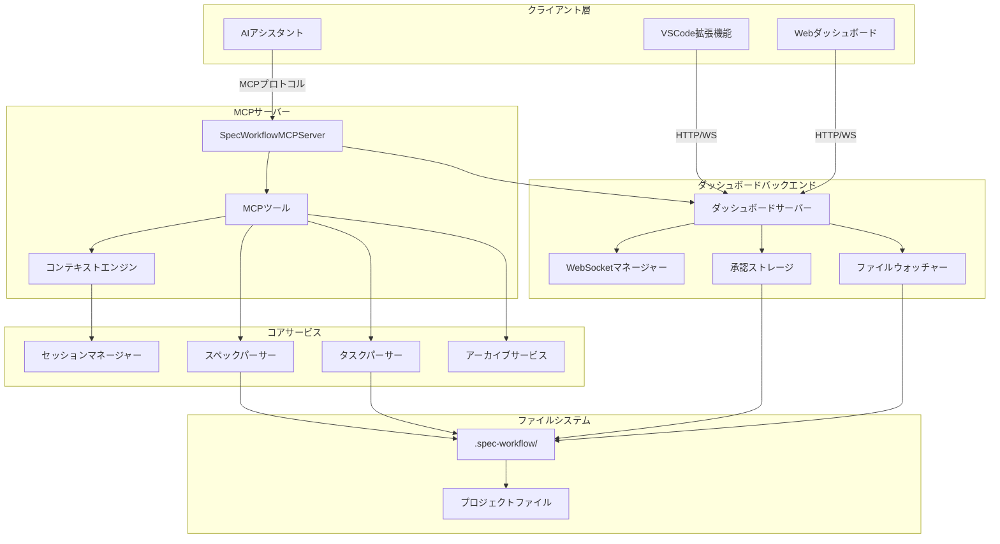
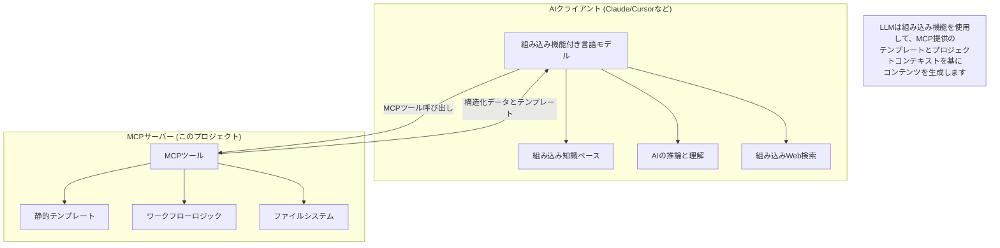
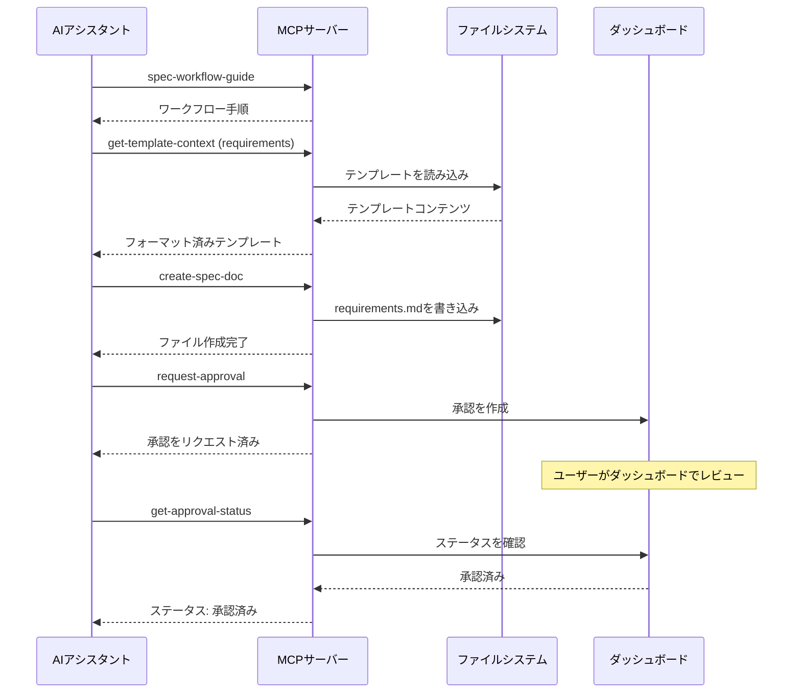
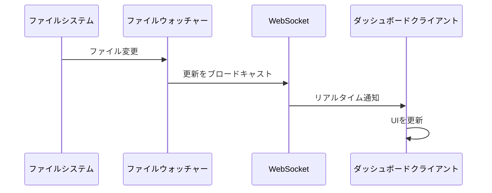

# アーキテクチャ概要

> **要約**: 構造化されたワークフローツール、リアルタイムダッシュボード、インテリジェントなコンテキスト管理を備えたMCPサーバー。

## 🏗️ システムアーキテクチャ

### 高レベルコンポーネント



## 🤖 AIアーキテクチャと統合モデル

### 純粋なMCPサーバー設計

これは、構造化されたツールインタラクションを通じて、接続されたLLMの組み込み能力を活用する**純粋なModel Context Protocol (MCP)サーバー**です：



**主要なアーキテクチャ原則:**

1. **LLMの組み込み能力を活用**: 接続されたAIの既存の知識、推論、検索能力を使用します
2. **独立した外部呼び出しなし**: MCPサーバーは独立したAPI呼び出しを行いません（NPMバージョンチェックを除く）
3. **LLMによるコンテンツ生成**: 接続されたLLMが組み込みの理解を使用してすべてのコンテンツを生成します
4. **構造化ワークフロー**: テンプレートを提供し、ワークフローを強制し、LLMにインテリジェントなコンテンツを埋めさせます
5. **人間による承認ゲートウェイ**: すべてのLLM生成コンテンツは、次に進む前に人間によるレビューが必要です

### 詳細な能力分析と拡張機会

| 能力 | 現在の実装 | LLMの組み込み機能 | 潜在的なMCP拡張 | 競合分析 |
|------------|----------------------|---------------------|---------------------------|---------------------|
| **Webスクレイピングとリサーチ** | ❌ 独立した能力なし | ✅ LLMに組み込みのWeb検索あり | 🔮 構造化Webスクレイピングツール、API統合、リサーチキャッシュの追加が可能 | 他のエージェント：カスタムスクレイパー、APIラッパー |
| **AIによる分析** | ❌ 独立したAI呼び出しなし | ✅ LLMがすべての分析を提供 | 🔮 特化型分析ツール、コード品質メトリクスの追加が可能 | 他のエージェント：複数AIモデル統合 |
| **コンテキストウィンドウ管理** | ❌ LLMコンテキスト管理なし | ✅ LLMが会話コンテキストを管理 | 🔮 コンテキスト最適化、メモリ管理の追加が可能 | 他のエージェント：高度なコンテキスト戦略 |
| **外部統合** | ❌ NPMバージョンチェックのみ | ✅ LLMが外部APIを呼び出し可能 | 🔮 GitHub統合、CI/CDフック、データベース接続の追加が可能 | 他のエージェント：広範なAPIエコシステム |
| **自動レビュープロセス** | ❌ 人間による承認のみ | ✅ LLMが分析・レビュー可能 | 🔮 自動品質ゲート、AIによる承認の追加が可能 | 他のエージェント：多段階AIレビュー |
| **ベストプラクティス標準** | ❌ 静的テンプレートのみ | ✅ LLMが最新のベストプラクティスを保持 | 🔮 動的テンプレート更新、標準APIの追加が可能 | 他のエージェント：ライブ標準データベース |
| **計画とオーケストレーション** | ❌ 固定ワークフローシーケンス | ✅ LLMが計画・推論可能 | 🔮 動的ワークフロー、適応型計画の追加が可能 | 他のエージェント：複雑なオーケストレーションエンジン |

### 競合機能分析

**従来の開発ツールとの比較：**
```typescript
interface CompetitiveAnalysis {
  specWorkflowMCP: {
    strengths: [
      "人間による監視の統合",
      "構造化されたワークフローの強制",
      "リアルタイムのダッシュボード監視",
      "LLMによるインテリジェントなコンテンツ"
    ];
    limitations: [
      "独立したWebスクレイピングなし",
      "自動AIレビューなし",
      "固定ワークフローテンプレート",
      "単一プロジェクトの範囲"
    ];
  };

  competitorAgents: {
    strengths: [
      "複数モデルのAI統合",
      "高度なWebスクレイピング能力",
      "自動化された品質保証",
      "動的なワークフロー適応"
    ];
    limitations: [
      "人間による監視が限定的",
      "複雑な設定要件",
      "高いリソース使用量",
      "暴走行動の可能性"
    ];
  };
}
```

**拡張ロードマップの洞察：**
```typescript
interface ExpansionOpportunities {
  phase1: {
    webIntegration: "GitHub API、Jira統合、Confluence同期の追加";
    smartTemplates: "プロジェクトタイプ検出に基づく動的テンプレート";
    qualityGates: "LLMを使用した自動コード品質分析";
  };

  phase2: {
    aiWorkflows: "LLMによる適応型ワークフロー生成";
    codeAnalysis: "詳細なコードベース分析とリファクタリング提案";
    teamCollaboration: "複数開発者の連携と競合解決";
  };

  phase3: {
    enterpriseFeatures: "SSO、監査証跡、コンプライアンスレポート";
    aiOrchestration: "マルチエージェント連携とタスク委任";
    predictiveAnalysis: "プロジェクトリスク分析とタイムライン予測";
  };
}
```

### LLMの組み込み能力の現在の活用方法

| LLMの能力 | MCPの活用方法 | 例 | 拡張の可能性 |
|---------------|---------------------|---------|-------------------|
| **組み込み知識** | LLMがソフトウェアエンジニアリングのベストプラクティスをテンプレートに適用 | 設計テンプレートを埋める際にSOLID原則を使用 | 🔮 動的なベストプラクティス更新 |
| **推論と理解** | LLMがプロジェクトコンテキストを分析し、適切なコンテンツを生成 | プロジェクト分析に基づき関連する要件を作成 | 🔮 高度なプロジェクトリスク評価 |
| **組み込みWeb検索** | LLMが現在の技術とプラクティスをリサーチ可能 | コンポーネント生成時に最新のReactパターンを検索 | 🔮 構造化されたリサーチキャッシュ |
| **コード理解** | LLMが提供されたコンテキストで既存のコードベースを分析 | 既存のパターンに基づき適切なAPI設計を提案 | 🔮 自動リファクタリング提案 |
| **技術文書作成** | LLMが構造化された技術ドキュメントを生成 | プロフェッショナルな要件・設計ドキュメントを作成 | 🔮 マルチフォーマットのドキュメント生成 |

### コンテキストフローアーキテクチャ

```typescript
// プロジェクトファイルからAIクライアントへのコンテキストフロー
interface ContextFlow {
  1: "AIクライアントがMCPツール呼び出しでコンテキストをリクエスト";
  2: "MCPサーバーが.spec-workflow/ディレクトリからファイルを読み込む";
  3: "MCPサーバーがテンプレートと解析を用いてデータを構造化";
  4: "MCPサーバーがフォーマット済みコンテキストをAIクライアントに返す";
  5: "AIクライアントが推論と生成にコンテキストを使用";
}
```

**重要**: MCPサーバーはAIクライアントのコンテキストウィンドウを拡張しません - AIクライアントが自身のコンテキスト管理に組み込むための構造化データを提供します。

## 🔧 コアコンポーネント

### MCPサーバー (`src/server.ts`)

すべての機能をオーケストレーションするメインサーバークラス：

```typescript
export class SpecWorkflowMCPServer {
  private server: Server;
  private dashboardServer?: DashboardServer;
  private sessionManager?: SessionManager;
}
```

**主な責務:**
- **ツール登録**: 13のMCPツールを管理
- **セッショントラッキング**: ダッシュボード接続を監視
- **正常なシャットダウン**: クライアント切断を処理
- **コンテキスト調整**: ツールに共有コンテキストを提供

### ツールシステム (`src/tools/`)

構造化されたツールでModel Context Protocolを実装：

```typescript
// ツールカテゴリ
const tools = [
  // ワークフローガイド
  'spec-workflow-guide', 'steering-guide',

  // ドキュメント作成
  'create-spec-doc', 'create-steering-doc',

  // コンテキスト読み込み
  'get-spec-context', 'get-steering-context', 'get-template-context',

  // ステータス管理
  'spec-list', 'spec-status', 'manage-tasks', 'refresh-tasks',

  // 承認ワークフロー
  'request-approval', 'get-approval-status', 'delete-approval'
];
```

**ツールアーキテクチャパターン:**
```typescript
export const toolNameTool: Tool = {
  name: 'tool-name',
  description: '使用方法を含む明確な説明',
  inputSchema: { /* JSONスキーマ検証 */ }
};

export async function toolNameHandler(
  args: ValidatedArgs,
  context: ToolContext
): Promise<ToolResponse> {
  // 実装
}
```

### コンテキストエンジン

効率的なトークン使用のためのインテリジェントなコンテキスト管理：

```typescript
interface ToolContext {
  projectPath: string;
  dashboardUrl?: string;
  sessionManager?: SessionManager;
}
```

**コンテキスト戦略:**
- **プリロード**: 起動時にテンプレートをキャッシュ
- **遅延読み込み**: オンデマンドでスペックを読み込み
- **キャッシュ無効化**: ファイル変更時にコンテンツをリフレッシュ
- **スマートチャンキング**: 大きなドキュメントを適切に分割

## 🗂️ データフロー

### 1. ワークフロー作成フロー



### 2. リアルタイムダッシュボード更新



## 📁 ファイルシステム構成

### プロジェクト構造
```
project-root/
├── .spec-workflow/              # すべてのワークフローデータ
│   ├── specs/                   # 仕様書
│   │   └── feature-name/        # 個々の仕様
│   │       ├── requirements.md  # フェーズ1
│   │       ├── design.md        # フェーズ2
│   │       └── tasks.md         # フェーズ3
│   ├── steering/                # プロジェクトガイダンス
│   │   ├── product.md           # 製品ビジョン
│   │   ├── tech.md              # 技術的決定
│   │   └── structure.md         # コード構成
│   ├── approvals/               # 承認ワークフローデータ
│   │   └── spec-name/           # スペックごとの承認
│   └── session.json             # アクティブなダッシュボードセッション
└── [あなたのプロジェクトファイル]        # 既存のプロジェクト
```

### ディレクトリの責務

| ディレクトリ | 目的 | 自動作成 |
|-----------|---------|--------------|
| `specs/` | 仕様書ドキュメント | ✅ |
| `steering/` | プロジェクトガイダンス | ✅ |
| `approvals/` | 承認ワークフロー | オンデマンド |
| `archive/` | 完了したスペック | オンデマンド |

## 🌐 ダッシュボードアーキテクチャ

### バックエンド (`src/dashboard/server.ts`)

WebSocketをサポートするFastifyベースのサーバー：

```typescript
export class DashboardServer {
  private app: FastifyInstance;
  private watcher: SpecWatcher;
  private approvalStorage: ApprovalStorage;
  private clients: Set<WebSocket>;
}
```

**特徴:**
- **静的ファイル配信**: フロントエンドアセット
- **WebSocket**: リアルタイム更新
- **REST API**: CRUD操作
- **ファイル監視**: 変更時の自動更新

### フロントエンド (`src/dashboard_frontend/`)

モダンなツールを備えたReactアプリケーション：

```
src/
├── modules/
│   ├── pages/           # メインアプリケーションページ
│   ├── components/      # 再利用可能なUIコンポーネント
│   ├── api/            # API通信
│   └── ws/             # WebSocket統合
├── main.tsx            # アプリケーションエントリポイント
└── App.tsx            # ルートコンポーネント
```

**技術スタック:**
- **React 18**: コンポーネントフレームワーク
- **TypeScript**: 型安全性
- **Vite**: ビルドツールと開発サーバー
- **Tailwind CSS**: ユーティリティファーストのスタイリング
- **WebSocket**: リアルタイム通信

## 🔄 状態管理

### セッション状態
- **サーバー**: アクティブなダッシュボードURLを追跡
- **クライアント**: 特定のダッシュボードインスタンスへの接続を維持
- **永続化**: `.spec-workflow/session.json`

### 承認状態
- **ストレージ**: `approvals/`ディレクトリ内のJSONファイル
- **ライフサイクル**: pending → approved/rejected → archived
- **同期**: WebSocketを介したリアルタイム更新

### スペック状態
- **解析**: マークダウンファイルからオンデマンド
- **キャッシュ**: ファイル変更時に無効化されるインメモリ
- **配布**: 接続されたクライアントにブロードキャスト

## 🚦 エラーハンドリング

### ツールエラーレスポンスパターン
```typescript
interface ToolResponse {
  success: boolean;
  message: string;
  data?: any;
  nextSteps?: string[];
  projectContext?: {
    projectPath: string;
    workflowRoot: string;
    dashboardUrl?: string;
  };
}
```

### エラーカテゴリ
1. **検証エラー**: 無効なパラメータ
2. **ファイルシステムエラー**: 権限、見つからない
3. **ネットワークエラー**: ダッシュボード接続の問題
4. **ワークフローエラー**: シーケンス外の操作

## ⚡ パフォーマンスとスケーラビリティ

### リソース使用量と制限

**メモリ消費量**:
```typescript
interface ResourceLimits {
  // プロジェクトごとのメモリ使用量
  templates: "~50KB (起動時にキャッシュ)";
  specContext: "スペックごとに10-100KB";
  approvalData: "承認ごとに1-5KB";
  sessionData: "プロジェクトごとに<1KB";

  // 推奨プロジェクト制限
  maxSpecs: "プロジェクトごとに50-100スペック";
  maxDocumentSize: "ドキュメントごとに200KB";
  maxProjectSize: ".spec-workflow/全体で5-10MB";

  // パフォーマンスしきい値
  contextLoadTime: "通常のスペックで<200ms";
  dashboardResponse: "API呼び出しで<50ms";
  fileWatcherDelay: "500msのデバウンス";
}
```

**ファイルシステムパフォーマンス**:
- **テンプレート読み込み**: <10ms（永続的にキャッシュ）
- **スペックコンテキスト読み込み**: コールドで50-200ms、キャッシュ済みで<5ms
- **ダッシュボードAPIレスポンス**: 通常<50ms
- **ファイルウォッチャー反応**: 500msのデバウンス

### スケーラビリティの制約

**単一プロジェクトの制限**:
```bash
# プロジェクトごとの推奨最大値
仕様書: 50-100
スペックごとのドキュメント: 3 (要件、設計、タスク)
ドキュメントサイズ: 各200KB
プロジェクト合計サイズ: 5-10MB
同時ダッシュボードユーザー: プロジェクトごとに1人
ファイル監視深度: .spec-workflow/ のみ
```

**複数プロジェクトのスケーリング**:
- 各プロジェクトは独立したMCPサーバーインスタンスを実行
- プロジェクト間で共有状態なし
- 線形スケーリング: Nプロジェクト = Nサーバーインスタンス
- メモリ使用量はプロジェクト数に比例して線形に増加

### パフォーマンス最適化戦略

**ファイルシステム最適化**:
```typescript
// 実装済み最適化
1. "テンプレートのプリロードと永続キャッシュ";
2. "スペックコンテキストのLRUキャッシュ（最大50エントリ）";
3. "デバウンス付きファイル監視（500ms）";
4. "承認データの遅延読み込み";
5. "PathUtilsによる効率的なパス解決";
```

**メモリ管理**:
```typescript
// メモリ最適化パターン
interface MemoryOptimization {
  templateCache: "永続的 - 小さな静的データ";
  specCache: "50MB制限付きLRU";
  approvalStorage: "オンデマンド読み込み";
  sessionTracking: "最小限のメタデータのみ";

  cleanup: {
    specCacheEviction: "制限に達したときにLRU";
    approvalCleanup: "承認後の手動削除";
    sessionExpiry: "サーバー再起動時";
  };
}
```

## 🔒 セキュリティに関する考慮事項

### ファイルシステムアクセス
- **制限された範囲**: `.spec-workflow/`ディレクトリのみ
- **パス検証**: ディレクトリトラバーサルを防止
- **安全な操作**: 任意のコマンド実行なし

### ネットワークセキュリティ
- **ローカルのみ**: ダッシュボードはlocalhostにバインド
- **外部呼び出しなし**: バージョンチェックを除く（オプション）
- **入力検証**: すべてのパラメータをサニタイズ

### データプライバシー
- **ローカルストレージ**: すべてのデータはユーザーのマシン上に留まる
- **テレメトリなし**: 使用状況データは送信されない
- **セッション分離**: 各プロジェクトは個別のセッションを持つ

### エンタープライズセキュリティに関する考慮事項

**ネットワークセキュリティ**:
```typescript
interface NetworkSecurity {
  inboundConnections: "localhostダッシュボードのみ（ポート3456）";
  outboundConnections: "NPMレジストリのバージョンチェックのみ";
  dataTransmission: "外部へのデータ送信なし";
  tlsCertificates: "不要 - localhostのみ";
  firewall: "ダッシュボードアクセスのためにlocalhost:3456を許可";
}
```

**データガバナンス**:
```typescript
interface DataGovernance {
  dataLocation: "すべてのデータはプロジェクトの.spec-workflow/ディレクトリ内";
  dataRetention: "手動 - ユーザーがすべてのデータライフサイクルを制御";
  dataDeletion: "rm -rf .spec-workflow/ ですべてのMCPデータを削除";
  auditTrail: "ファイルシステムのタイムスタンプ、アプリケーションログなし";
  compliance: "ローカルマシンからデータは出ない（バージョンチェックを除く）";
}
```

**アクセス制御**:
- **ファイルシステム**: OSのファイル権限を使用
- **ダッシュボード**: 認証なし - localhostアクセスのみ
- **VSCode**: VSCodeユーザーセッションと統合
- **マルチユーザー**: マルチユーザー環境向けには設計されていない

**エンタープライズ展開に関する考慮事項**:
```bash
# 企業ファイアウォールルール
許可するアウトバウンド: registry.npmjs.org (443) # バージョンチェックのみ
許可するインバウンド: 不要
許可するlocalhost: 3456 (ダッシュボード), 動的ポート (MCP)

# セキュリティスキャン
静的分析: TypeScriptコードベース、バイナリ依存なし
脆弱性スキャン: NPM audit、外部サービスなし
データ分類: すべてのデータはユーザー管理、ローカルストレージのみ
```

---

**次へ**: [MCPツールAPIリファレンス →](api-reference.md)
