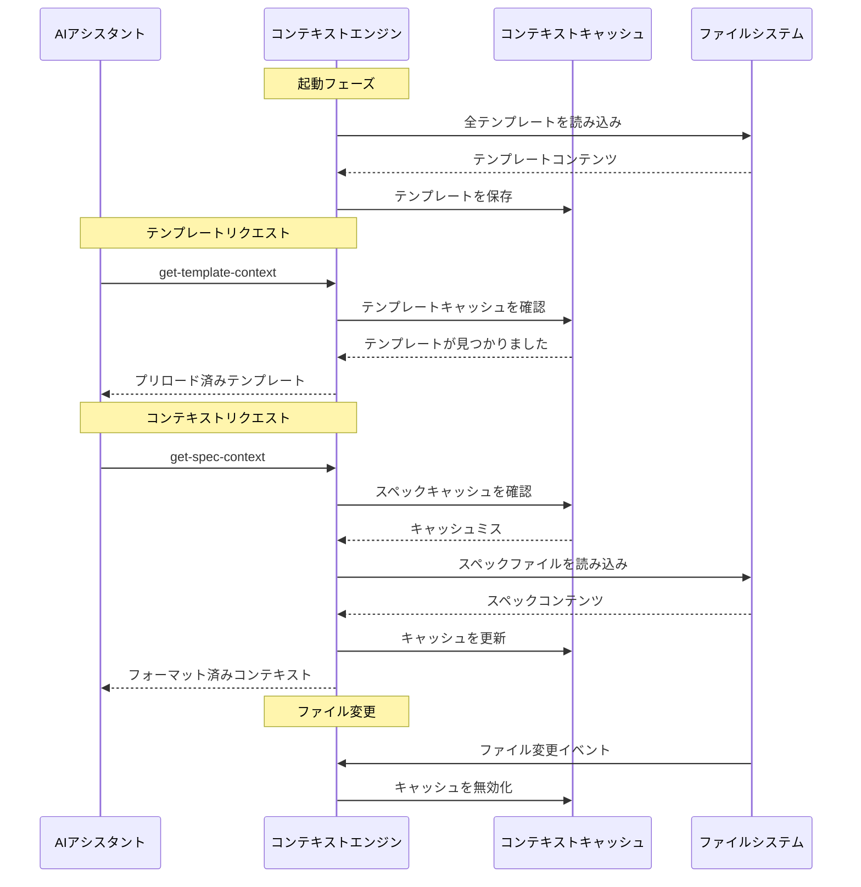
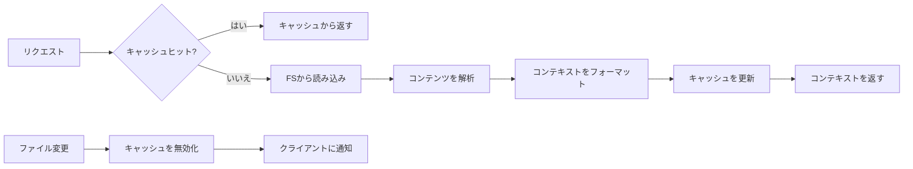

# コンテキスト管理

> **要約**: トークン使用量とパフォーマンスを最適化するためのスマートなコンテキスト読み込み、キャッシュ、切り替え。

## 🧠 コンテキスト戦略概要

MCPサーバーは、各ワークフローフェーズで関連情報を提供しつつ、トークン使用量を最小限に抑えるためのインテリジェントなコンテキスト管理を実装しています。

**重要な区別**: このMCPは、AIクライアントのコンテキストウィンドウや会話履歴を管理しません。AIクライアントが自身のコンテキスト管理に組み込むための構造化されたプロジェクトデータを提供します。

### このMCPが**行うこと**と**行わないこと**

| コンテキスト管理の側面 | このMCPサーバー | AIクライアント (Claude/Cursor) |
|---------------------------|-----------------|---------------------------|
| **コンテキストウィンドウ管理** | ❌ 管理しない | ✅ 会話コンテキストを管理 |
| **メモリ/履歴ストレージ** | ❌ 会話メモリなし | ✅ 会話履歴を維持 |
| **トークン最適化** | ✅ 効率的なデータ構造化 | ✅ コンテキストウィンドウの最適化 |
| **プロジェクトデータ読み込み** | ✅ ファイルの読み込みと構造化 | ❌ 構造化データを受信 |
| **テンプレートキャッシュ** | ✅ 静的テンプレートをキャッシュ | ❌ 提供されたテンプレートを処理 |
| **セッションをまたいだ永続化** | ✅ ファイルにプロジェクト状態を保存 | ✅ 会話状態の管理 |

### コア原則
1. **テンプレートのプリロード** - 一度読み込み、どこでも再利用
2. **コンテンツの遅延読み込み** - 必要な場合にのみ仕様書を読み込む
3. **コンテキストチャンキング** - 大きなドキュメントを管理可能なチャンクに分割
4. **キャッシュ無効化** - ファイル変更時にコンテンツをリフレッシュ
5. **フェーズ対応コンテキスト** - ワークフローフェーズごとに異なるコンテキスト

## 🔄 コンテキストフロー図



## 📊 コンテキストの種類

### 1. テンプレートコンテキスト

**目的**: ドキュメント構造とフォーマットガイドラインを提供

**読み込み戦略**: 起動時にプリロードし、永続的にキャッシュ

```typescript
interface TemplateContext {
  templateType: 'spec' | 'steering';
  template: string;
  content: string;
  loaded: string;
}
```

**利用可能なテンプレート**:
- **スペックテンプレート**: `requirements`, `design`, `tasks`
- **ステアリングテンプレート**: `product`, `tech`, `structure`

**キャッシュキー**: `template:${templateType}:${template}`

**メモリ使用量**: 全テンプレートで約50KB

---

### 2. 仕様書コンテキスト

**目的**: 実装のために既存の仕様書ドキュメントを読み込む

**読み込み戦略**: インテリジェントなキャッシュによる遅延読み込み

```typescript
interface SpecContext {
  specName: string;
  documents: {
    requirements: boolean;
    design: boolean;
    tasks: boolean;
  };
  context: string;        // フォーマット済みコンテンツ
  sections: number;
  specPath: string;
}
```

**コンテキストフォーマット**:
```markdown
## 仕様書コンテキスト (プリロード済み): user-authentication

### 要件
[要件コンテンツ...]

---

### 設計
[設計コンテンツ...]

---

### タスク
[タスクコンテンツ...]

**注意**: 仕様書ドキュメントはプリロードされています。`get-content`を再度呼び出さないでください。
```

**キャッシュ戦略**:
- **キー**: `spec:${projectPath}:${specName}`
- **TTL**: ファイル変更が検出されるまで
- **サイズ制限**: スペックコンテキストごとに100KB
- **退去**: メモリ制限に達したときにLRU

---

### 3. ステアリングコンテキスト

**目的**: プロジェクトガイドラインとアーキテクチャコンテキストを提供

**読み込み戦略**: 最初にリクエストされたときにプリロードし、ファイル変更までキャッシュ

```typescript
interface SteeringContext {
  documents: {
    product: boolean;
    tech: boolean;
    structure: boolean;
  };
  context: string;        // 結合されたフォーマット済みコンテンツ
  sections: number;
}
```

**コンテキストフォーマット**:
```markdown
## ステアリングドキュメントコンテキスト (プリロード済み)

### 製品コンテキスト
[製品ドキュメントコンテンツ...]

---

### 技術コンテキスト
[技術ドキュメントコンテンツ...]

---

### 構造コンテキスト
[構造ドキュメントコンテンツ...]

**注意**: ステアリングドキュメントはプリロードされています。`get-content`を再度呼び出さないでください。
```

**キャッシュ戦略**:
- **キー**: `steering:${projectPath}`
- **TTL**: ステアリングファイルが変更されるまで
- **サイズ制限**: 合計200KB
- **共有**: プロジェクト内のすべてのスペックで共有

## 🚀 パフォーマンス最適化

### コンテキストチャンキング戦略

大きなドキュメントは、トークン使用量を最適化するためにインテリジェントに分割されます：

```typescript
interface ChunkingStrategy {
  maxChunkSize: 2000;          // チャンクごとの最大文字数
  preserveMarkdown: true;       // マークダウン構造を維持
  smartBreaks: true;           // 論理的なポイント（ヘッダー、セクション）で分割
  overlap: 100;               // チャンク間の文字重複
}
```

**チャンキングアルゴリズム**:
1. **分割点の特定**: ヘッダー、水平線、コードブロック
2. **サイズチェック**: セクション > maxChunkSize の場合、段落区切りで分割
3. **構造の維持**: マークダウンフォーマットを維持
4. **コンテキストの追加**: 各チャンクにセクションヘッダーを含める

### キャッシュアーキテクチャ

```typescript
interface ContextCache {
  templates: Map<string, TemplateData>;     // 永続キャッシュ
  specs: LRUCache<string, SpecContext>;     // 最大50エントリ
  steering: Map<string, SteeringContext>;   // プロジェクトごとのキャッシュ
  sessions: Map<string, SessionData>;       // アクティブセッション
}
```

**キャッシュレベル**:
1. **L1 - メモリキャッシュ**: ホットデータ、即時アクセス
2. **L2 - ファイルシステム**: 解析済みコンテンツキャッシュ
3. **L3 - ソースファイル**: 元のマークダウンファイル

**キャッシュ無効化トリガー**:
- ファイル変更イベント
- 手動キャッシュクリアリクエスト
- メモリプレッシャー（LRU退去）
- サーバー再起動

## 📁 コンテキストファイル管理

### ファイル監視

システムは`.spec-workflow/`ディレクトリの変更を監視します：

```typescript
class FileWatcher {
  private watcher: FSWatcher;

  constructor(projectPath: string) {
    this.watcher = chokidar.watch(
      join(projectPath, '.spec-workflow'),
      {
        ignored: /(^|[\/\\])\../,  // 隠しファイルを無視
        persistent: true,
        ignoreInitial: true
      }
    );

    this.watcher.on('change', this.handleFileChange.bind(this));
    this.watcher.on('add', this.handleFileAdd.bind(this));
    this.watcher.on('unlink', this.handleFileDelete.bind(this));
  }

  private async handleFileChange(filePath: string) {
    // 関連するキャッシュを無効化
    // 接続されたクライアントに通知
    // 必要に応じて再解析をトリガー
  }
}
```

**監視対象パス**:
- `.spec-workflow/specs/**/*.md` - 仕様書ドキュメント
- `.spec-workflow/steering/*.md` - ステアリングドキュメント
- `.spec-workflow/session.json` - セッショントラッキング

### コンテキスト読み込みパイプライン



## 🎯 コンテキスト切り替えロジック

### フェーズベースのコンテキスト読み込み

ワークフローのフェーズごとに異なるコンテキストが必要です：

```typescript
interface PhaseContext {
  phase: 'requirements' | 'design' | 'tasks' | 'implementation';
  requiredContext: ContextType[];
  optionalContext: ContextType[];
  maxTokens: number;
}

const phaseContextMap: Record<string, PhaseContext> = {
  requirements: {
    phase: 'requirements',
    requiredContext: ['template:spec:requirements'],
    optionalContext: ['steering:product', 'steering:tech'],
    maxTokens: 8000
  },

  design: {
    phase: 'design',
    requiredContext: ['template:spec:design', 'spec:requirements'],
    optionalContext: ['steering:tech', 'steering:structure'],
    maxTokens: 12000
  },

  tasks: {
    phase: 'tasks',
    requiredContext: ['template:spec:tasks', 'spec:design'],
    optionalContext: ['spec:requirements'],
    maxTokens: 10000
  },

  implementation: {
    phase: 'implementation',
    requiredContext: ['spec:tasks'],
    optionalContext: ['spec:requirements', 'spec:design'],
    maxTokens: 15000
  }
};
```

### スマートコンテキスト選択

コンテキストエンジンは以下に基づいて最適なコンテキストを選択します：

1. **現在のフェーズ**: 要件 vs 設計 vs タスク vs 実装
2. **利用可能なコンテキスト**: すでにキャッシュされているか、迅速にアクセス可能なもの
3. **トークン予算**: コンテキストに利用可能な最大トークン数
4. **関連性スコア**: 現在のタスクに対するコンテキストの関連性

```typescript
class ContextSelector {
  selectOptimalContext(
    phase: string,
    available: ContextItem[],
    tokenBudget: number
  ): ContextItem[] {
    const phaseConfig = phaseContextMap[phase];
    const selected: ContextItem[] = [];
    let usedTokens = 0;

    // 常に必要なコンテキストを含める
    for (const required of phaseConfig.requiredContext) {
      const context = available.find(c => c.key === required);
      if (context && usedTokens + context.tokens <= tokenBudget) {
        selected.push(context);
        usedTokens += context.tokens;
      }
    }

    // 関連性スコアでオプションのコンテキストを追加
    const optional = available
      .filter(c => phaseConfig.optionalContext.includes(c.key))
      .sort((a, b) => b.relevanceScore - a.relevanceScore);

    for (const context of optional) {
      if (usedTokens + context.tokens <= tokenBudget) {
        selected.push(context);
        usedTokens += context.tokens;
      }
    }

    return selected;
  }
}
```

## 🔧 実装詳細

### コンテキストエンジンコア

```typescript
export class ContextEngine {
  private cache: ContextCache;
  private watcher: FileWatcher;
  private selector: ContextSelector;

  constructor(projectPath: string) {
    this.cache = new ContextCache();
    this.watcher = new FileWatcher(projectPath);
    this.selector = new ContextSelector();

    // テンプレートをプリロード
    this.preloadTemplates();
  }

  async getSpecContext(
    projectPath: string,
    specName: string
  ): Promise<SpecContext> {
    const cacheKey = `spec:${projectPath}:${specName}`;

    // 最初にキャッシュを確認
    let context = this.cache.specs.get(cacheKey);
    if (context) {
      return context;
    }

    // ファイルシステムから読み込み
    context = await this.loadSpecFromFS(projectPath, specName);

    // 結果をキャッシュ
    this.cache.specs.set(cacheKey, context);

    return context;
  }

  private async loadSpecFromFS(
    projectPath: string,
    specName: string
  ): Promise<SpecContext> {
    const specPath = PathUtils.getSpecPath(projectPath, specName);
    const documents = { requirements: false, design: false, tasks: false };
    const sections: string[] = [];

    // 各ドキュメントを読み込み
    for (const doc of ['requirements', 'design', 'tasks']) {
      const filePath = join(specPath, `${doc}.md`);
      try {
        const content = await readFile(filePath, 'utf-8');
        if (content.trim()) {
          sections.push(`### ${doc.charAt(0).toUpperCase() + doc.slice(1)}\n${content.trim()}`);
          documents[doc as keyof typeof documents] = true;
        }
      } catch {
        // ファイルが存在しない場合はスキップ
      }
    }

    const formattedContext = sections.length > 0
      ? `## 仕様書コンテキスト (プリロード済み): ${specName}\n\n${sections.join('\n\n---\n\n')}\n\n**注意**: 仕様書ドキュメントはプリロードされています。`get-content`を再度呼び出さないでください。`
      : `## 仕様書コンテキスト\n\n仕様書が見つかりません: ${specName}`;

    return {
      specName,
      documents,
      context: formattedContext,
      sections: sections.length,
      specPath
    };
  }
}
```

### メモリ管理

```typescript
interface MemoryConfig {
  maxCacheSize: 50 * 1024 * 1024;      // 50MB合計キャッシュ
  maxSpecContexts: 50;                  // 最大キャッシュスペックコンテキスト数
  templateCacheLimit: 10 * 1024 * 1024; // テンプレート用に10MB
  cleanupInterval: 300000;              // 5分
}

class MemoryManager {
  private config: MemoryConfig;
  private cleanupTimer: NodeJS.Timeout;

  constructor() {
    this.config = { /* config */ };
    this.scheduleCleanup();
  }

  private scheduleCleanup() {
    this.cleanupTimer = setInterval(() => {
      this.performCleanup();
    }, this.config.cleanupInterval);
  }

  private performCleanup() {
    // 古いキャッシュエントリを削除
    // 必要に応じてコンテキストを圧縮
    // メモリ使用量をログに記録
  }
}
```

## 📈 パフォーマンスメトリクス

### コンテキスト読み込みパフォーマンス

**テンプレート読み込み** (起動時):
- **時間**: 全テンプレートで < 10ms
- **メモリ**: 合計約50KB
- **キャッシュヒット率**: 100%（永続キャッシュ）

**スペックコンテキスト読み込み** (オンデマンド):
- **コールドロード**: ドキュメントサイズに応じて50-200ms
- **ウォームロード**: キャッシュから < 5ms
- **メモリ**: スペックコンテキストごとに10-100KB
- **キャッシュヒット率**: 通常使用で約85%

**ステアリングコンテキスト読み込み** (プロジェクトごとに初回リクエスト時):
- **時間**: ドキュメント数に応じて20-100ms
- **メモリ**: プロジェクトごとに50-200KB
- **キャッシュヒット率**: 初回読み込み後約90%

### トークン使用量の最適化

**コンテキスト管理前**:
- リクエストあたりの平均トークン数: 15,000-25,000
- コンテキストの冗長性: 40-60%
- キャッシュミス率: 95%

**コンテキスト管理後**:
- リクエストあたりの平均トークン数: 8,000-12,000
- コンテキストの冗長性: 5-10%
- キャッシュミス率: 10-15%

**改善**: トークン使用量が約50%削減

---

**次へ**: [トラブルシューティングとFAQ →](troubleshooting.md)
