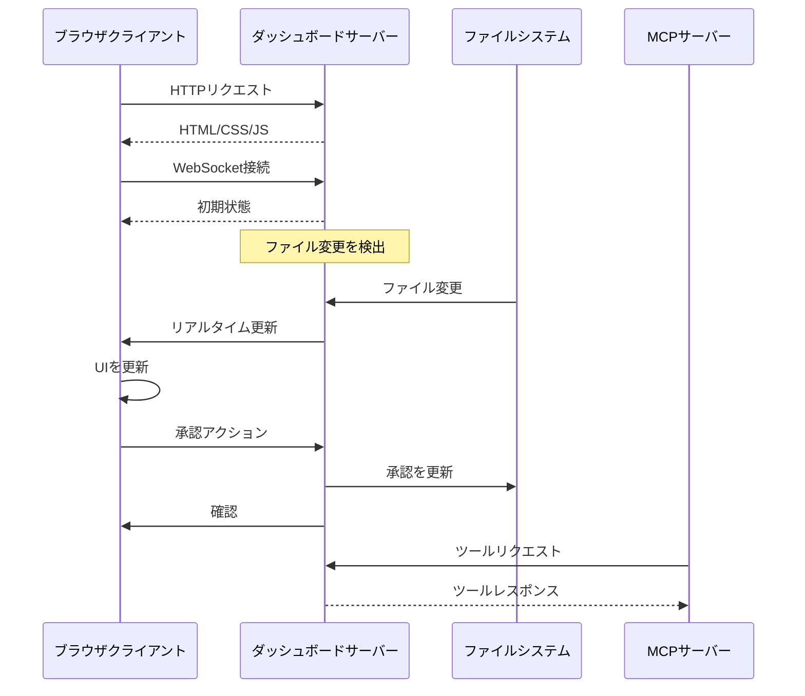

# ダッシュボードシステム

> **要約**: スペックの監視、承認の管理、進捗の追跡を行うためのリアルタイムWebダッシュボード。

## 🌐 ダッシュボード概要

ダッシュボードは以下のためのWebインターフェースを提供します：
- **仕様書管理** - スペックの表示、作成、整理
- **承認ワークフロー** - ドキュメントのレビューと承認
- **タスク追跡** - 実装進捗の監視
- **リアルタイム更新** - WebSocketを介したライブ同期
- **ドキュメント表示** - 構文ハイライト付きのマークダウンドキュメントの閲覧

## 🏗️ アーキテクチャ

### フロントエンドスタック
- **React 18** - フック付きのコンポーネントフレームワーク
- **TypeScript** - 型安全な開発
- **Tailwind CSS** - ユーティリティファーストのスタイリング
- **Vite** - 高速なビルドツールと開発サーバー
- **React Router** - クライアントサイドのルーティング

### バックエンドスタック
- **Fastify** - 高性能Webサーバー
- **WebSocket** - リアルタイム通信
- **Chokidar** - ファイルシステムの監視
- **Markdown-it** - マークダウンの解析とレンダリング

### 通信フロー



## 🚀 ダッシュボードの起動

### スタンドアロンモード
```bash
# ダッシュボードのみ（MCPサーバーなし）
npx -y @pimzino/spec-workflow-mcp@latest --dashboard

# カスタムポート付き
npx -y @pimzino/spec-workflow-mcp@latest --dashboard --port 8080

# 特定のプロジェクトディレクトリから
cd /path/to/project
npx -y @pimzino/spec-workflow-mcp@latest --dashboard
```

### MCPサーバーとの自動起動
```json
{
  "mcpServers": {
    "spec-workflow": {
      "command": "npx",
      "args": ["-y", "@pimzino/spec-workflow-mcp@latest", "/project/path", "--AutoStartDashboard"]
    }
  }
}
```

### 開発モード
```bash
# ダッシュボード開発サーバーを起動（ホットリロード）
npm run dev:dashboard

# http://localhost:5173 で利用可能
# http://localhost:3456 のバックエンドに接続
```

## 📱 ユーザーインターフェース

### メインナビゲーション

```
┌─────────────────────────────────────┐
│ スペックワークフローダッシュボード  │
├─────────────────────────────────────┤
│ 📋 スペック   │ メインコンテンツエリア│
│ 📝 ステアリング │                     │
│ ✅ 承認       │                     │
│ 📊 タスク     │                     │
│ 📈 統計      │                     │
└─────────────────────────────────────┘
```

### ページコンポーネント

#### スペックページ (`SpecsPage.tsx`)
```typescript
interface SpecsPageProps {
  specs: SpecData[];
  onSpecSelect: (spec: SpecData) => void;
}

// 特徴:
// - すべての仕様書を一覧表示
// - ステータス表示（未開始、進行中、準備完了、実装中、完了）
// - タスク完了の進捗バー
// - クイックアクション（表示、アーカイブ、削除）
```

#### 承認ページ (`ApprovalsPage.tsx`)
```typescript
interface ApprovalsPageProps {
  approvals: ApprovalData[];
  onApprovalAction: (id: string, action: 'approve' | 'reject') => void;
}

// 特徴:
// - 保留中の承認を一覧表示
// - 構文ハイライト付きのドキュメントプレビュー
// - コメント付きでの承認/拒否
// - リアルタイムのステータス更新
```

#### スペックビューア (`SpecViewerPage.tsx`)
```typescript
interface SpecViewerProps {
  specName: string;
  documents: SpecDocuments;
}

// 特徴:
// - タブ付きインターフェース（要件、設計、タスク）
// - コードハイライト付きのマークダウンレンダリング
// - タスクステータスインジケーター
// - ドキュメントメタデータ（作成日、変更日、ステータス）
```

#### タスクページ (`TasksPage.tsx`)
```typescript
interface TasksPageProps {
  tasks: TaskData[];
  onTaskUpdate: (taskId: string, status: TaskStatus) => void;
}

// 特徴:
// - ステータスインジケーター付きのタスク一覧
// - 仕様書ごとの進捗追跡
// - ステータスによるフィルタリング（保留中、進行中、完了）
// - 一括タスク操作
```

## 🔄 リアルタイム機能

### WebSocket統合

**接続設定**:
```typescript
// src/dashboard_frontend/src/modules/ws/WebSocketProvider.tsx
const WebSocketProvider = ({ children }: { children: React.ReactNode }) => {
  const [socket, setSocket] = useState<WebSocket | null>(null);
  const [message, setMessage] = useState<any>(null);

  useEffect(() => {
    const ws = new WebSocket('ws://localhost:3456/ws');

    ws.onmessage = (event) => {
      const data = JSON.parse(event.data);
      setMessage(data);
    };

    ws.onopen = () => {
      console.log('WebSocket connected');
    };

    ws.onerror = (error) => {
      console.error('WebSocket error:', error);
    };

    setSocket(ws);

    return () => {
      ws.close();
    };
  }, []);

  return (
    <WebSocketContext.Provider value={{ socket, message }}>
      {children}
    </WebSocketContext.Provider>
  );
};
```

**メッセージタイプ**:
```typescript
interface WebSocketMessage {
  type: 'initial' | 'specs-updated' | 'approval-updated' | 'task-updated';
  data: any;
  timestamp: string;
}

// メッセージ例
const messages = {
  initial: {
    type: 'initial',
    data: { specs: [], approvals: [] }
  },

  specsUpdated: {
    type: 'specs-updated',
    data: { specs: [/* 更新されたスペック */] }
  },

  approvalUpdated: {
    type: 'approval-updated',
    data: { approvalId: '...', status: 'approved' }
  }
};
```

### ファイル監視

**バックエンドファイルウォッチャー**:
```typescript
// src/dashboard/watcher.ts
export class SpecWatcher {
  private watcher: FSWatcher;

  constructor(projectPath: string, parser: SpecParser) {
    this.watcher = chokidar.watch(
      join(projectPath, '.spec-workflow'),
      {
        ignored: /(^|[\/\\])\../, // 隠しファイルを無視
        persistent: true,
        ignoreInitial: true
      }
    );

    this.watcher.on('change', async (filePath) => {
      // 影響を受けるスペックを再解析
      const specs = await parser.getAllSpecs();
      // 接続されているすべてのクライアントにブロードキャスト
      this.broadcastUpdate('specs-updated', { specs });
    });
  }

  private broadcastUpdate(type: string, data: any) {
    const message = JSON.stringify({ type, data, timestamp: new Date().toISOString() });
    this.clients.forEach(client => {
      if (client.readyState === WebSocket.OPEN) {
        client.send(message);
      }
    });
  }
}
```

## 🎨 スタイリングとテーマ

### テーマシステム

**テーマプロバイダー**:
```typescript
// src/dashboard_frontend/src/modules/theme/ThemeProvider.tsx
const ThemeProvider = ({ children }: { children: React.ReactNode }) => {
  const [theme, setTheme] = useState<'light' | 'dark'>('light');

  useEffect(() => {
    // システムテーマを自動検出
    const mediaQuery = window.matchMedia('(prefers-color-scheme: dark)');
    setTheme(mediaQuery.matches ? 'dark' : 'light');

    mediaQuery.addEventListener('change', (e) => {
      setTheme(e.matches ? 'dark' : 'light');
    });
  }, []);

  return (
    <div className={theme === 'dark' ? 'dark' : ''}>
      {children}
    </div>
  );
};
```

**カラーパレット**:
```css
/* src/dashboard_frontend/src/modules/theme/theme.css */
:root {
  /* ライトテーマ */
  --color-primary: #3b82f6;
  --color-secondary: #64748b;
  --color-success: #10b981;
  --color-warning: #f59e0b;
  --color-error: #ef4444;
  --color-background: #ffffff;
  --color-surface: #f8fafc;
  --color-text: #1f2937;
}

.dark {
  /* ダークテーマ */
  --color-primary: #60a5fa;
  --color-secondary: #94a3b8;
  --color-success: #34d399;
  --color-warning: #fbbf24;
  --color-error: #f87171;
  --color-background: #1f2937;
  --color-surface: #374151;
  --color-text: #f9fafb;
}
```

### コンポーネントスタイリング

**Tailwind設定**:
```javascript
// tailwind.config.js
module.exports = {
  content: ['./src/**/*.{js,ts,jsx,tsx}'],
  darkMode: 'class',
  theme: {
    extend: {
      colors: {
        primary: 'var(--color-primary)',
        secondary: 'var(--color-secondary)',
        success: 'var(--color-success)',
        warning: 'var(--color-warning)',
        error: 'var(--color-error)',
        background: 'var(--color-background)',
        surface: 'var(--color-surface)',
        text: 'var(--color-text)'
      }
    }
  }
};
```

## 🔧 バックエンドAPI

### RESTエンドポイント

```typescript
// メインAPIルート
const routes = {
  // スペック
  'GET /api/specs': 'すべての仕様書を一覧表示',
  'GET /api/specs/:name': '特定のスペック詳細を取得',
  'PUT /api/specs/:name': 'スペックメタデータを更新',
  'DELETE /api/specs/:name': '仕様書を削除',

  // 承認
  'GET /api/approvals': '保留中の承認を一覧表示',
  'GET /api/approvals/:id': '承認詳細を取得',
  'POST /api/approvals/:id/approve': 'ドキュメントを承認',
  'POST /api/approvals/:id/reject': 'コメント付きで拒否',
  'DELETE /api/approvals/:id': '承認を削除',

  // タスク
  'GET /api/tasks/:specName': '仕様書のタスクを取得',
  'PUT /api/tasks/:specName/:taskId': 'タスクステータスを更新',

  // システム
  'GET /api/health': 'ヘルスチェックエンドポイント',
  'GET /api/version': 'サーバーバージョン情報を取得'
};
```

**API実装例**:
```typescript
// src/dashboard/server.ts
export class DashboardServer {
  private async setupRoutes() {
    // すべての仕様書を取得
    this.app.get('/api/specs', async (request, reply) => {
      try {
        const specs = await this.parser.getAllSpecs();
        reply.send({ success: true, data: specs });
      } catch (error) {
        reply.status(500).send({ success: false, error: error.message });
      }
    });

    // ドキュメントを承認
    this.app.post('/api/approvals/:id/approve', async (request, reply) => {
      try {
        const { id } = request.params as { id: string };
        await this.approvalStorage.approveDocument(id);

        // 更新をブロードキャスト
        this.broadcastToClients('approval-updated', { approvalId: id, status: 'approved' });

        reply.send({ success: true });
      } catch (error) {
        reply.status(500).send({ success: false, error: error.message });
      }
    });
  }
}
```

## 📊 パフォーマンス最適化

### フロントエンド最適化

**React最適化**:
```typescript
// 高コストなレンダリングのためのメモ化コンポーネント
const SpecsList = React.memo(({ specs }: { specs: SpecData[] }) => {
  return (
    <div>
      {specs.map(spec => (
        <SpecCard key={spec.name} spec={spec} />
      ))}
    </div>
  );
});

// 大規模データセットのための仮想化リスト
import { FixedSizeList as List } from 'react-window';

const VirtualizedTaskList = ({ tasks }: { tasks: TaskData[] }) => {
  return (
    <List
      height={400}
      itemCount={tasks.length}
      itemSize={60}
      itemData={tasks}
    >
      {TaskRow}
    </List>
  );
};
```

**遅延読み込み**:
```typescript
// ページごとのコード分割
const SpecsPage = lazy(() => import('./modules/pages/SpecsPage'));
const ApprovalsPage = lazy(() => import('./modules/pages/ApprovalsPage'));

// Suspense境界
<Suspense fallback={<LoadingSpinner />}>
  <Routes>
    <Route path="/specs" element={<SpecsPage />} />
    <Route path="/approvals" element={<ApprovalsPage />} />
  </Routes>
</Suspense>
```

### バックエンド最適化

**レスポンスキャッシング**:
```typescript
// 頻繁にリクエストされるデータをキャッシュ
class ResponseCache {
  private cache = new Map<string, { data: any; timestamp: number }>();
  private ttl = 30000; // 30秒

  get(key: string) {
    const entry = this.cache.get(key);
    if (entry && Date.now() - entry.timestamp < this.ttl) {
      return entry.data;
    }
    this.cache.delete(key);
    return null;
  }

  set(key: string, data: any) {
    this.cache.set(key, { data, timestamp: Date.now() });
  }
}
```

**効率的なファイル監視**:
```typescript
// デバウンスされたファイル変更ハンドリング
import { debounce } from 'lodash';

const debouncedUpdate = debounce(async (filePath: string) => {
  // 影響を受けるスペックのみを再解析
  const affectedSpecs = await this.getAffectedSpecs(filePath);
  const updatedSpecs = await this.parser.parseSpecs(affectedSpecs);
  this.broadcastUpdate('specs-updated', { specs: updatedSpecs });
}, 500);
```

## 🐛 ダッシュボードの問題のデバッグ

### 開発ツール

**ブラウザ開発ツールチェックリスト**:
1. **コンソールタブ** - JavaScriptエラーを確認
2. **ネットワークタブ** - APIリクエストとWebSocket接続を確認
3. **アプリケーションタブ** - localStorageとセッションデータを確認
4. **要素タブ** - DOMとCSSの問題を調査

**一般的なデバッグコマンド**:
```javascript
// ブラウザコンソールで

// WebSocket接続を確認
console.log('WebSocket state:', window.WebSocket.READY_STATE);

// APIエンドポイントをテスト
fetch('/api/specs').then(r => r.json()).then(console.log);

// React DevToolsを確認
window.React = React; // React DevToolsを有効化
```

### バックエンドデバッグ

**サーバーログ**:
```bash
# デバッグログを有効化
DEBUG=dashboard:* npm run dev:dashboard

# 特定のモジュールを確認
DEBUG=dashboard:server,dashboard:watcher npm run dev:dashboard
```

**APIテスト**:
```bash
# エンドポイントを直接テスト
curl -X GET http://localhost:3456/api/specs
curl -X GET http://localhost:3456/api/health
curl -X POST http://localhost:3456/api/approvals/test-id/approve
```

---

**次へ**: [貢献ガイドライン →](contributing.md)
